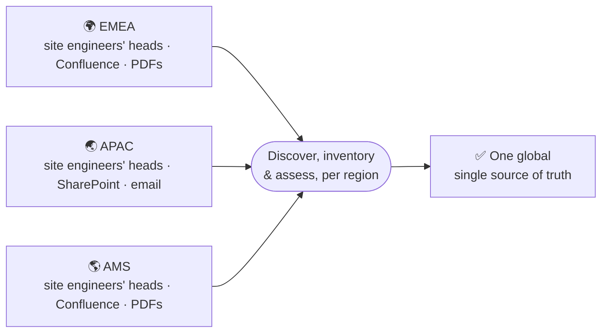

# How I'd Drive This Transformation

If I walked in on day one with responsibility for all REO documentation, here's the sequence I'd follow. Not because it's some textbook framework, but because skipping steps will cost me more time later.

---

## Week 1-2: Discover What You Actually Have

**Goal:** Understand the landscape without judgment or changes.

**What I'd do:**

I'd spend the first two weeks mapping, not fixing. I'd talk to the regional ops leads, find out where documentation lives (Confluence spaces? SharePoint sites? Google Docs? Email? PDFs printed and pinned up at the site itself?). I'd identify the SMEs who actually know how things work.

I'd ask simple questions:

- What processes do you need documented?
- Which ones are already written down somewhere?
- Which ones are just in your head?
- What keeps you up at night about documentation?

**Why this matters:** If I start rewriting before I know what I'm rewriting, I'll miss things, duplicate effort, or fix the wrong problem.

**Tools I'd use:** Stakeholder interviews, file system exploration, Confluence workspace audits, SharePoint site review.

**Output:** A rough map of where documentation lives and who knows what.

---

## Week 3-4: Build a Master Inventory

**Goal:** Create a single source of truth about what documentation exists.

**What I'd do:**

I'd build a spreadsheet (or set up a documentation management system) with every document:

| Document | Type | Owner | Last Updated | Region(s) | Status | Notes |
|----------|------|-------|--------------|-----------|--------|-------|
| Maintenance Approval Process | SOP | – (unknown) | Mar 2023 | EMEA | Active | No owner; 18 months old |
| Site Provisioning v1 | SOP | John S. | Jun 2024 | EMEA | Active | John left; nobody covering |
| Site Provisioning v2 | SOP | – | Nov 2023 | APAC | Active | Contradicts v1; which one is current? |
| Emergency Response | Policy | Compliance | Jan 2025 | Global | Active | Current |
| VPN Setup Legacy | SOP | – | Jan 2021 | – | Obsolete? | System decommissioned; doc still linked |

The spreadsheet becomes my north star. Every decision for the next 4 months references this inventory.

**Why this matters:** You can't fix what you can't see. An inventory makes it impossible to ignore gaps or contradictions.

**Tools I'd use:** Google Sheets or Excel for the master registry; Confluence/SharePoint built-in audit features; Zapier or automation if using a documentation management system.

**Output:** Master inventory showing what exists, who owns it, and basic status.

---

## Week 5-6: Assess for Problems

**Goal:** Understand quality, gaps, and risk systematically.

**What I'd do:**

I'd go through each document and score it across seven dimensions (see [Documentation Audit](/docs/process-governance/audit) for the full framework):

- Accuracy (Is this still correct?)
- Completeness (Are critical steps missing?)
- Consistency (Does this contradict other docs?)
- Ownership (Is someone accountable?)
- Currency (When was this last reviewed?)
- Usability (Could someone actually follow this?)
- Control (Is there version control, approval, change history?)

High-scoring documents are high-risk. The assessment tells me which procedures pose immediate operational or compliance risk versus which are stable.

**Tools I'd use:** Spreadsheet with risk scoring formula; checklist template; stakeholder interviews (phone/Zoom); documentation management system's built-in audit features if available.

**Output:** Risk matrix showing which documents need immediate attention.

---

## Week 7-8: Prioritize Based on Real Impact

**Goal:** Focus on highest-impact work first; avoid trying to fix everything.

**What I'd do:**

I don't fix documents in order of how broken they are. I fix them based on:

**Risk × Operational Importance × Frequency of Use × Regulatory/Compliance Impact**

For example:
- A safety-critical SOP used by field teams daily = **Fix now** (before audit)
- An architecture document reviewed 8 months ago = **Review quarterly**
- An archived procedure from 5 years ago = **Retain for audit; no work needed**
- Three contradictory "how to provision a site" SOPs = **Merge into one version** (high priority)

I'd present this prioritization to the Senior Facilities Manager with realistic timelines. "Here's what we fix before the audit (3 weeks), here's what we fix in the next quarter (8 weeks), here's what gets archived (low priority)."

**Why this matters:** Trying to fix everything creates weak documentation everywhere. Focusing on highest-impact work means I can do deep, good work on what matters most.

**Tools I'd use:** Risk scoring spreadsheet with conditional formatting; timeline roadmap (Gantt chart in Sheets/Excel or project tool like Asana); Slack/email for stakeholder communication.

**Output:** A ranked remediation list with timelines.

---

## Week 9-10: Standardize on a Single Template & Style

**Goal:** Establish consistency so all future procedures follow the same model.

**What I'd do:**

I'd define what every procedure must have:

**Structure:**
- Purpose (why does this exist?)
- Scope (what does it apply to?)
- Roles & Responsibilities (who does what?)
- Mandatory Requirements (what MUST happen)
- Procedure (step-by-step)
- Exceptions (when the standard doesn't apply)
- Escalation (what gets escalated, to whom, how fast?)
- Records & Evidence (what gets kept, how long?)
- Document Control (owner, approver, version, review date)

**Style:**
- Plain language, no jargon (or define it once)
- Active voice
- Present tense
- Second person for things the reader does
- Warnings labeled as "Caution" or "Important"
- Numbered steps for sequences
- Decision trees where the path depends on conditions
- US English spelling, consistently – with teams in EMEA, APAC, and AMS all reading the same procedures, one spelling convention beats three

**Why this matters:** If every SOP looks the same, readers learn the layout once and can navigate all of them. If every SOP is different, I'm forcing people to relearn the structure every time.

**Tools I'd use:** Confluence template feature (if using Confluence); Markdown template in Git repo; shared Google Doc for style guide; Word template if using traditional document management.

**Output:** A template library and style guide.

---

## Week 11-14: Rewrite High-Priority Procedures

**Goal:** Fix the procedures that matter most, using the new template and standards.

**What I'd do:**

For each high-priority procedure, I'd:

1. **Interview the SME.** Not "tell me what the procedure should say" – but "walk me through what you actually do." I'd take notes, ask clarifying questions, understand the real workflow.

2. **Write it down.** Using the template, in plain language, with decision points and exceptions clearly marked.

3. **Add mandatory vs. guidance language.** Engineers **MUST** record completion. They **SHOULD** schedule maintenance during low-occupancy periods. They **MAY** use the recommended checklist.

4. **Identify what gets documented.** What evidence has to be kept? For how long? Why?

5. **Add escalation pathways.** What gets escalated? When? To whom?

**Why this matters:** The SME knows what they do. I don't. My job is to make what they know clear and usable, not to pretend I'm the expert.

If there's disagreement ("the document says X, but I do Y"), I ask: Is X wrong? Is Y a workaround you've developed? Is there an exception that should be documented? I don't decide. The SME does. But I make sure the decision gets recorded.

**Tools I'd use:** Confluence or Git for version control; Google Docs/Word for collaborative drafting; SME interviews (in-person or recorded); screen recording for capturing actual workflows.

**Output:** Updated, standardized procedures that reflect reality and are actually usable.

---

## Week 15: Validate with Field Teams

**Goal:** Make sure the procedures actually work for the people who use them.

**What I'd do:**

I'd give the new procedures to field teams and ask: "Walk through this with me. Does it match what you actually do? Are we missing anything? Is anything unclear?"

I might find:
- A step in the wrong order
- A precondition we forgot
- Terminology that doesn't match what field teams actually call things
- An edge case the procedure doesn't cover

I'd update based on feedback. Not every suggestion gets implemented (scope creep is real), but critical feedback does.

**Why this matters:** A procedure I wrote in isolation might be perfectly clear to me and completely unclear to someone doing it under time pressure on a site.

**Tools I'd use:** Collaborative review in Confluence/Google Docs; comments and threads for feedback; Zoom for walkthrough sessions; shared checklist to track feedback implementation.

**Output:** Validated procedures that field teams actually understand.

---

## Week 16: Establish Ownership & Review Cycles

**Goal:** Introduce version control, approvals, and defined ownership, so documentation is audit-ready, controlled, and consistently maintained. Support implementation with practical guidance, and establish ongoing review cycles so standards stay embedded in operations and current over time.

**What I'd do:**

For every procedure, I'd assign:

- **Primary owner** – The person accountable for keeping it current
- **Backup owner** – Covers when the primary is out or moves teams
- **Approver** – Usually a manager; has final sign-off authority
- **Review cycle** – When it gets checked (SOPs quarterly, policies annually)

I'd make this visible. The owner's name goes on the document itself. The review date is on the document. The next review due date is on the document. When the review date arrives, the system reminds the owner.

**Why this matters:** Documentation decays because nobody is accountable for it. Naming an owner makes accountability explicit. A review cycle makes checking automatic.

**Tools I'd use:** Documentation management system with approval workflows (Confluence, Paligo, or similar); calendar automation (Zapier, IFTTT); Slack/email reminders; spreadsheet tracking if using Git-based docs.

**Output:** Documented ownership model; automated review reminders.

---

## Throughout: Handle Global vs. Local Variation

**Goal:** Engage regions to align requirements, balancing global consistency with essential local considerations.

**The mistake:** Assuming every regional difference is a documentation problem.

**The reality:** Many variations exist for valid reasons.

**What I'd do:**

When I find procedures that differ by region, I'd ask:

- Is this mandated by law or regulation? → Document as regional requirement
- Is this mandated by a client contract? → Document as regional requirement  
- Does this affect safety or compliance? → Keep globally consistent; document why regions might vary
- Is this a difference in tools or local contacts? → Standardize the process; locally configure the details
- Is this just preference or historical practice? → Standardize globally; document why the variation existed

**How to structure it:**

**[Global Required]** – Everyone follows these steps

**[Regional Required]** – This part varies because of local law/client contract

**[Locally Configurable]** – Same process; you fill in local tool names, contacts, hours

This way, I'm not pretending there's no variation. I'm making it explicit and manageable.

**Tools to implement:**
- Confluence with parent/child pages (global parent, regional children)
- Markdown with conditional includes (``)
- Documentation management systems with regional branching
- Shared spreadsheet tracking why variations exist

---

## The Outcome

After about 4 months of this work:

✅ **Visibility** – Everyone knows what documentation exists and who owns it  
✅ **Priority** – We fixed the highest-risk problems first  
✅ **Consistency** – All procedures follow the same template and style  
✅ **Clarity** – Procedures distinguish mandatory requirements from guidance  
✅ **Accountability** – Named owners; automated review cycles  
✅ **Compliance** – Audit trail; change history; evidence retention clear  
✅ **Scalability** – Framework works whether we have 50 docs or 500  
✅ **Sustainability** – Governance model keeps things current over time  

The audit goes smoothly. Regional leaders have clarity on their procedures. Field teams can actually follow the documentation. And when someone asks "what's the right way to do X?", there's a single, current, approved answer.

---

## Why This Sequence Works

Each step informs the next:

- **Discover without inventory** = You'll miss things and redo work
- **Inventory without assessment** = You won't know what to fix first
- **Assessment without prioritization** = You'll try to fix everything and fail
- **Prioritization without standardization** = Your fixes won't be consistent
- **Standardization without rewriting** = You've built a model with nothing in it
- **Rewriting without validation** = You've created new problems
- **Validation without ownership** = The documentation will decay within a year

Each phase is short (1-2 weeks), focused, and produces concrete output.

---

## Where AI Tooling Fits

The 16-week timeline above assumes manual work throughout. In practice, I'd use AI coding and writing assistants (Claude Code, Codex-style agents) for the mechanical, high-volume parts of this work – not for the parts that depend on people.

**Where it helps:**

- **Inventory** – Bulk-scanning Confluence/SharePoint exports, tagging metadata, and flagging likely duplicates faster than manual cataloguing
- **Assess** – Comparing documents against each other and against what SMEs described, to surface contradictions, staleness, and gaps – procedures that are referenced but don't exist, or steps nobody wrote down
- **Standardize** – Drafting a first-pass template structure from the target format, for a human to refine
- **Rewrite** – Drafting first-pass rewrites from SME interview transcripts against the approved template, for a human to edit and verify
- **Govern (ongoing)** – Once the framework exists, automating the recurring mechanics: flagging documents past their review date, catching broken cross-references, and drafting the audit-trail entry for a completed review

**Where it doesn't:**

Discover, Prioritize, and Validate are paced by stakeholder calendars and trust, not authoring speed. An AI-assisted draft still needs a human in the room to confirm it's actually correct – the tool speeds up producing a draft, not earning the buy-in. Establishing ownership itself is the same story: naming an accountable person and getting their sign-off is a conversation, not a task to automate – automation earns its keep afterward, keeping that structure running.

| Phase | Without AI | With AI |
|---|---|---|
| Discover | 2 wks | 2 wks |
| Inventory | 2 wks | ~1 wk |
| Assess | 2 wks | ~1 wk |
| Prioritize | 2 wks | 2 wks |
| Standardize | 2 wks | ~1.5 wks |
| Rewrite | 4 wks | ~2.5 wks |
| Validate | 1 wk | 1 wk |
| Govern | 1 wk | 1 wk |
| **Total** | **16 wks** | **~12 wks** |

Roughly 25% faster overall, concentrated entirely in the phases where speed was ever the bottleneck. The phases that determine whether documentation actually sticks – interviews, validation, ownership – stay the same length, because no tool shortens the time it takes to earn someone's trust.
